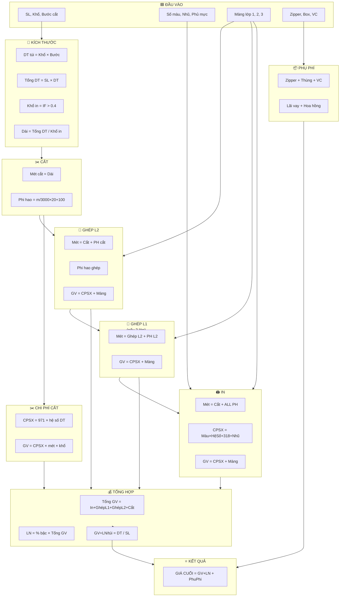

# 📐 CÔNG THỨC TÍNH GIÁ BAO BÌ — BẢN PHÂN TÍCH HOÀN CHỈNH

> **Nguồn**: Sheet TRANG (Excel tính giá LTS 2023)  
> **Engine**: `engine.js` — đã code hóa toàn bộ  
> **Ngày phân tích**: 14/03/2026

---

## 📦 MỤC LỤC

1. [Tổng quan luồng tính giá](#1-tổng-quan-luồng-tính-giá)
2. [Đầu vào (Input)](#2-đầu-vào-input)
3. [Bước 1: Kích thước cơ bản](#3-bước-1-kích-thước-cơ-bản)
4. [Bước 2: CPSX Cắt](#4-bước-2-cpsx-cắt)
5. [Bước 3: Ghép lần 2 — Lớp trong](#5-bước-3-ghép-lần-2--lớp-trong)
6. [Bước 4: Ghép lần 1 — Lớp giữa (nếu có)](#6-bước-4-ghép-lần-1--lớp-giữa-nếu-có)
7. [Bước 5: CPSX In — Lớp ngoài](#7-bước-5-cpsx-in--lớp-ngoài)
8. [Bước 6: CPSX Cắt — Chi phí](#8-bước-6-cpsx-cắt--chi-phí)
9. [Bước 7: Tổng giá vốn](#9-bước-7-tổng-giá-vốn)
10. [Bước 8: Lợi nhuận](#10-bước-8-lợi-nhuận)
11. [Bước 9: Chi phí phụ / túi](#11-bước-9-chi-phí-phụ--túi)
12. [Bước 10: Giá cuối cùng](#12-bước-10-giá-cuối-cùng)
13. [Bảng tra cứu](#13-bảng-tra-cứu)
14. [Ví dụ tính mẫu](#14-ví-dụ-tính-mẫu)

---

## 1. TỔNG QUAN LUỒNG TÍNH GIÁ

```
┌──────────┐    ┌──────────┐    ┌──────────┐    ┌──────────┐    ┌──────────┐
│  KÍCH    │───▶│  CẮT     │───▶│  GHÉP    │───▶│  IN      │───▶│  TỔNG    │
│  THƯỚC   │    │  (mét,   │    │  (mét,   │    │  (mét,   │    │  GIÁ VỐN │
│  CƠ BẢN  │    │  phi hao)│    │  phi hao)│    │  phi hao)│    │          │
└──────────┘    └──────────┘    └──────────┘    └──────────┘    └─────┬────┘
                                                                      │
     ┌──────────────────────────────────────────────────────────────────┘
     ▼
┌──────────┐    ┌──────────┐    ┌──────────┐
│  + LỢI   │───▶│  + PHỤ   │───▶│  GIÁ     │
│  NHUẬN   │    │  PHÍ     │    │  CUỐI    │
│  (% bậc) │    │  /túi    │    │  CÙNG    │
└──────────┘    └──────────┘    └──────────┘
```

> [!IMPORTANT]
> **Nguyên tắc cốt lõi**: Tính **ngược từ CẮT → GHÉP → IN**. Mỗi bước cộng phi hao của bước trước, nên mét nguyên liệu **tăng dần** từ cắt → in.

---

## 2. ĐẦU VÀO (Input)

| Ký hiệu | Tên | Ví dụ SP1 | Ví dụ SP2 | Đơn vị |
|----------|-----|-----------|-----------|--------|
| `quantity` | Số lượng thành phẩm | 30,000 | 20,000 | túi |
| `spreadWidth` | Khổ trãi | 0.54 | 0.84 | m |
| `cutStep` | Bước cắt | 0.145 | 0.28 | m |
| `numColors` | Số màu in | 4 | 2 | màu |
| `layer1Id` | Màng lớp ngoài (in) | PET | PET | — |
| `layer2Id` | Màng lớp giữa (ghép L1) | *(không)* | *(không)* | — |
| `layer3Id` | Màng lớp trong (ghép L2) | LLDPE | CPP50 | — |
| `metallicSurcharge` | Phụ phí in nhũ/mờ | 0 | 400 | đ/m |
| `coverageRatio` | Tỉ lệ phủ mực | 1 | 1 | 0~1 |
| `profitColumn` | Loại lợi nhuận | 2 | 2 | 1=thường, 2=zip/3lớp |
| `hasZipper` | Có zipper không | Không | Có | true/false |
| `handleWeight` | Trọng lượng quai | 0 | 0 | gram |
| `shippingPerKm` | Giá VC/km/tấn | 5,000 | 5,000 | đ |
| `shippingKm` | Tổng km vận chuyển | 200 | 200 | km |
| `boxPrice` | Giá thùng giấy | 18,000 | 18,000 | đ/thùng |
| `bagsPerBox` | Số túi/thùng | 1,000 | 1,000 | túi |

---

## 3. BƯỚC 1: KÍCH THƯỚC CƠ BẢN

Tính các thông số hình học cơ bản của túi và đơn hàng.

| Công thức | Ý nghĩa | Excel |
|-----------|----------|-------|
| `bagArea = spreadWidth × cutStep` | Diện tích 1 túi (m²) | E89 |
| `totalArea = quantity × bagArea` | Tổng diện tích đơn hàng (m²) | F89 |
| `printWidth = IF(spreadWidth > 0.4, spreadWidth, spreadWidth × 2)` | Khổ màng in thành phẩm (m) | G89 |
| `filmLength = totalArea / printWidth` | Dài màng thành phẩm (m) | H89 |

> [!NOTE]
> **Quy tắc in đôi**: Nếu khổ trãi ≤ 0.4m → in 2 con hình trên 1 khổ (nhân đôi khổ), tối ưu hiệu suất máy in.

### Ví dụ:
```
SP2: spreadWidth = 0.84m, cutStep = 0.28m, quantity = 20,000
  bagArea    = 0.84 × 0.28         = 0.2352 m²
  totalArea  = 20,000 × 0.2352     = 4,704 m²
  printWidth = 0.84 (> 0.4)        = 0.84 m
  filmLength = 4,704 / 0.84        = 5,600 m
```

---

## 4. BƯỚC 2: CPSX CẮT — Số mét & Phi hao

Xác định số mét cần cắt và phi hao (hao hụt) trong quá trình cắt.

| Công thức | Ý nghĩa | Excel |
|-----------|----------|-------|
| `cutWidth = printWidth` | Khổ cắt = Khổ in TP | F94 = G89 |
| `cutMeters = filmLength` | Mét cắt = Dài màng TP | G94 = H89 |
| `cutWaste = cutMeters / 3000 × 20 + 100` | Phi hao cắt (m) | H94 |
| `cutWastePercent = IF(2 lớp, 3%, 3 lớp → 6%)` | Tỉ lệ phi hao cắt | E94 |

### Công thức phi hao cắt giải thích:
```
cutWaste = (cutMeters / 3000) × 20 + 100
           ├─── cứ 3000m ───┤  ├20m┤  ├100m cố định┤
```
- Cứ mỗi **3,000m** màng → hao **20m** (do thay cuộn, căn chỉnh)
- Cộng **100m** phi hao setup cố định

### Ví dụ:
```
SP2: cutMeters = 5,600m
  cutWaste = 5600/3000 × 20 + 100 = 37.33 + 100 = 137.33 m
```

---

## 5. BƯỚC 3: GHÉP LẦN 2 — Lớp trong

Ghép lớp màng bên trong (ví dụ: CPP, PE/LLDPE).

| Công thức | Ý nghĩa | Excel |
|-----------|----------|-------|
| `lam2Width = cutWidth + 0.02` | Khổ ghép = Khổ TP + 2cm lề | F93 |
| `lam2Meters = cutMeters + cutWaste` | Mét ghép = Mét cắt + phi hao cắt | G93 |
| `lam2Waste = lam2Meters / 3000 × 20 + 100` | Phi hao ghép (m) | H93 |
| `lam2CPSX = 684` | CPSX ghép cố định (đ/m) | K93 |
| `lam2CostCPSX = lam2CPSX × (lam2Waste + lam2Meters) × lam2Width` | Thành tiền CPSX ghép | L93 |
| `lam2CostMaterial = layer3.pricePerM2 × (lam2Waste + lam2Meters) × lam2Width` | Thành tiền màng | M93 |
| **`lam2TotalCost = lam2CostCPSX + lam2CostMaterial`** | **Giá vốn lớp trong** | **N93** |

> [!NOTE]
> **Khổ NL rộng hơn 2cm** so với khổ TP (`+0.02m`) vì cần lề 2 bên (mỗi bên 1cm) cho quá trình ghép.

### Ví dụ:
```
SP2: layer3 = CPP50 (pricePerM2 = 1,881.82 đ/m²)
  lam2Width    = 0.84 + 0.02             = 0.86 m
  lam2Meters   = 5,600 + 137.33          = 5,737.33 m
  lam2Waste    = 5737.33/3000*20 + 100   = 138.25 m
  lam2CostCPSX = 684 × (138.25+5737.33) × 0.86 = 3,456,252 đ
  lam2CostMat  = 1881.82 × (138.25+5737.33) × 0.86 = 9,508,829 đ
  lam2Total    = 3,456,252 + 9,508,829   = 12,965,081 đ
```

---

## 6. BƯỚC 4: GHÉP LẦN 1 — Lớp giữa (nếu có)

Chỉ tính khi có **lớp giữa** (layer2 ≠ null, tức cấu trúc 3 lớp).

| Công thức | Ý nghĩa | Excel |
|-----------|----------|-------|
| `lam1Width = cutWidth + 0.02` | Khổ ghép L1 | F92 |
| `lam1Meters = lam2Meters + lam2Waste` | Mét ghép L1 = Mét ghép L2 + phi hao L2 | G92 |
| `lam1Waste = lam1Meters / 3000 × 20 + 100` | Phi hao ghép L1 | H92 |
| `lam1CPSX = 684` | CPSX ghép cố định | K92 |
| `lam1CostCPSX = lam1CPSX × (lam1Waste + lam1Meters) × lam1Width` | Thành tiền CPSX | L92 |
| `lam1CostMaterial = layer2.pricePerM2 × (lam1Waste + lam1Meters) × lam1Width` | Thành tiền màng | M92 |
| **`lam1TotalCost = lam1CostCPSX + lam1CostMaterial`** | **Giá vốn lớp giữa** | **N92** |

> [!TIP]
> Nếu **không có lớp giữa** (2 lớp), tất cả giá trị = **0**.

---

## 7. BƯỚC 5: CPSX IN — Lớp ngoài

Tính chi phí in ấn trên lớp màng ngoài cùng (PET, PA, BOPP...).

### 7.1. Số mét & Phi hao

| Công thức | Ý nghĩa | Excel |
|-----------|----------|-------|
| `printNLWidth = cutWidth + 0.02` | Khổ NL in = Khổ TP + 2cm | F91 |
| `printMeters = cutMeters + cutWaste + lam2Waste + lam1Waste` | Mét in = mét cắt + TẤT CẢ phi hao | G91 |
| `printWaste = colorSetup + (printMeters/6000 × 40) + bonus` | Phi hao in | H91 |

### 7.2. Phi hao in chi tiết

```
printWaste = colorSetup                       ← Phi hao setup theo số màu
           + (printMeters / 6000 × 40)        ← Cứ 6000m hao 40m
           + IF(printMeters > 50000,           ← Bonus nếu > 5 vạn mét
               printMeters / 50000 × 400, 0)
```

**Bảng setup theo số màu:**

| Số màu | Setup (m) |
|--------|-----------|
| 1 | 400 |
| 2 | 500 |
| 3 | 800 |
| 4 | 1,000 |
| 5 | 1,200 |
| 6 | 1,500 |
| 7 | 1,700 |
| 8 | 1,800 |

### 7.3. CPSX In (đ/m)

```
printCPSX = numColors × cpsxFactor × coverageRatio + 318 + metallicSurcharge
```

| Thành phần | Giá trị | Giải thích |
|------------|---------|------------|
| `numColors` | 1~8 | Số màu in |
| `cpsxFactor` | **135** nếu PET hoặc PA, **120** cho còn lại | Hệ số chi phí in/màu |
| `coverageRatio` | 0~1 | Tỉ lệ phủ mực (1 = 100%) |
| `318` | Cố định | CPSX cơ bản (baseCPSX) |
| `metallicSurcharge` | 0 hoặc 400 | Phụ phí in nhũ/mờ |

### 7.4. Thành tiền chi phí In

| Công thức | Ý nghĩa | Excel |
|-----------|----------|-------|
| `printCostCPSX = printCPSX × (printWaste + printMeters) × printNLWidth` | Thành tiền CPSX in | L91 |
| `printCostMaterial = layer1.pricePerM2 × (printWaste + printMeters) × printNLWidth` | Thành tiền màng | M91 |
| **`printTotalCost = printCostCPSX + printCostMaterial`** | **Giá vốn lớp in** | **N91** |

### Ví dụ:
```
SP2: PET (pricePerM2=572.73), 2 màu, phủ 100%, nhũ 400đ
  printNLWidth = 0.86m
  printMeters  = 5600 + 137.33 + 138.25 + 0 = 5,875.58 m
  colorSetup   = 500 (2 màu)
  printWaste   = 500 + 5875.58/6000*40 + 0 = 539.17 m
  printCPSX    = 2 × 135 × 1 + 318 + 400 = 988 đ/m  ← (nếu IF đúng)
  printCostCPSX = 988 × (539.17+5875.58) × 0.86 = 5,451,xxx đ
  printCostMat  = 572.73 × (539.17+5875.58) × 0.86 = 3,159,557 đ
  printTotal    = ~8,610,xxx đ
```

---

## 8. BƯỚC 6: CPSX CẮT — Chi phí

Tính chi phí sản xuất cho công đoạn cắt túi.

```
cutCPSX = IF(bagArea < 0.07,  971 × 1.4,         ← Túi nhỏ: hệ số 1.4
          IF(bagArea < 0.2,   971 × 1.2,          ← Túi vừa: hệ số 1.2
                              971 × 0.8))         ← Túi lớn: hệ số 0.8
```

| DT túi (m²) | Hệ số | CPSX (đ/m) |
|--------------|--------|------------|
| < 0.07 | × 1.4 | 1,359.4 |
| 0.07 ~ 0.2 | × 1.2 | 1,165.2 |
| ≥ 0.2 | × 0.8 | 776.8 |

| Công thức | Ý nghĩa | Excel |
|-----------|----------|-------|
| `cutCostCPSX = cutCPSX × (cutWaste + cutMeters) × cutWidth` | Thành tiền CPSX cắt | L94 |
| **`cutTotalCost = cutCostCPSX`** | **Giá vốn cắt** (không có nguyên liệu) | **N94** |

> [!NOTE]
> Bước cắt **không có chi phí nguyên liệu** vì nguyên liệu đã được tính ở các bước ghép/in.

---

## 9. BƯỚC 7: TỔNG GIÁ VỐN

```
totalProductionCost = printTotalCost       ← Giá vốn lớp IN (N91)
                    + lam1TotalCost        ← Giá vốn lớp GHÉP L1 (N92)
                    + lam2TotalCost        ← Giá vốn lớp GHÉP L2 (N93)
                    + cutTotalCost         ← Giá vốn CẮT (N94)
```

**Excel**: `O91 = SUM(N91:N94)`

---

## 10. BƯỚC 8: LỢI NHUẬN

### 10.1. Tra tỉ lệ lợi nhuận

Dựa trên **tổng giá vốn** và **loại sản phẩm** (thường/zip), tra bảng bậc:

```
profitRate = lookupProfit(totalProductionCost, profitColumn)
```

| Tổng giá vốn (VNĐ) | Túi thường (col1) | Túi zip/3 lớp (col2) |
|---------------------|--------------------|-----------------------|
| < 9.9tr | 50% | 80% |
| < 19tr | 22% | 42% |
| < 30tr | 17% | 27% |
| < 40tr | 11% | 20% |
| < 60tr | 8% | 19% |
| < 80tr | 8% | 18% |
| < 100tr | 7.5% | 17% |
| < 150tr | 7% | 16% |
| < 200tr | 7% | 16% |
| < 300tr | 6% | 15% |
| < 400tr | 5% | 15% |
| < 600tr | 5% | 15% |
| ≥ 600tr | 4% | 11% |

### 10.2. Tính lợi nhuận

| Công thức | Ý nghĩa | Excel |
|-----------|----------|-------|
| `profitAmount = profitRate × totalProductionCost` | Số tiền LN | P93 |
| `revenue = totalProductionCost + profitAmount` | Doanh thu SX = GV + LN | Q91 |
| `costPerUnit = revenue / quantity` | Giá vốn + LN / túi | I89 |

---

## 11. BƯỚC 9: CHI PHÍ PHỤ / TÚI

### 11.1. Zipper (nếu có)

```
zipperTotal   = (cutMeters + cutWaste) × 378         ← 378 đ/m (= 360 × 1.05)
zipperPerUnit = zipperTotal / quantity
```

### 11.2. Thùng giấy

```
numBoxes      = quantity / bagsPerBox                 ← Mặc định 1,000 túi/thùng
boxTotal      = boxPrice × numBoxes                   ← Mặc định 18,000 đ/thùng
boxPerUnit    = boxTotal / quantity                    ← = boxPrice / bagsPerBox
```

### 11.3. Trọng lượng (Tare)

```
totalThickness = layer1.thickness + (layer2 ? layer2.thickness : 0) + layer3.thickness + cutWastePercent
tareWeight     = (bagArea × totalThickness) × 0.93 + handleWeight       ← gram/túi
```

### 11.4. Vận chuyển

```
shippingRate    = shippingPerKm × shippingKm           ← đ/tấn (VD: 5000 × 200 = 1,000,000 đ/tấn)
totalWeightTons = tareWeight × quantity / 1,000,000     ← Quy đổi sang tấn
shippingTotal   = totalWeightTons × shippingRate
shippingPerUnit = shippingTotal / quantity
```

### 11.5. Lãi vay

```
dailyInterest   = 0.10 / 365                          ← Lãi suất ngày (10%/năm)
interestRate30  = dailyInterest × 30                   ← Lãi 30 ngày ≈ 0.822%
interestPerUnit = interestRate30 × costPerUnit         ← Lãi vay / túi
```

### 11.6. Hoa hồng

```
commissionPerUnit = commissionRate × costPerUnit        ← Mặc định = 0
```

---

## 12. BƯỚC 10: GIÁ CUỐI CÙNG

```
┌─────────────────────────────────────────────────────────────┐
│                                                             │
│  finalPrice = costPerUnit         ← Giá vốn + LN / túi    │
│             + zipperPerUnit       ← Zipper / túi           │
│             + boxPerUnit          ← Thùng giấy / túi       │
│             + shippingPerUnit     ← Vận chuyển / túi       │
│             + interestPerUnit     ← Lãi vay / túi          │
│             + commissionPerUnit   ← Hoa hồng / túi         │
│                                                             │
│  ⭐ Excel: P89 = SUM(I89:O89)                              │
│                                                             │
└─────────────────────────────────────────────────────────────┘
```

---

## 13. BẢNG TRA CỨU

### 13.1. Giá nguyên liệu (Data2023)

Công thức tính giá VNĐ/m²:
```
pricePerM2 = pricePerKg × thickness × density / 1000
```

| Màng | Độ dầy (mic) | Tỉ trọng | Giá (đ/kg) | Giá (đ/m²) |
|------|-------------|-----------|------------|------------|
| PET 12mic | 12 | 1.40 | 34,091 | 572.73 |
| PA 15mic | 15 | 1.16 | 70,000 | 1,218.00 |
| MPET 12mic | 12 | 1.40 | 40,909 | 687.27 |
| CPP 25mic | 25 | 0.92 | 40,909 | 940.91 |
| CPP 50mic | 50 | 0.92 | 40,909 | 1,881.82 |
| PE/LLDPE 120mic | 120 | 0.925 | 40,000 | 4,440.00 |
| Nhôm AL 6mic | 6 | 2.76 | 110,909 | 1,836.65 |
| BOPP 18mic | 18 | 0.91 | 41,364 | 677.54 |
| BOPP 20mic | 20 | 0.91 | 41,364 | 752.82 |
| BOPP 30mic | 30 | 0.91 | 40,000 | 1,092.00 |
| Matt BOPP 20mic | 20 | 0.88 | 50,000 | 880.00 |
| Màng ngọc 40mic | 40 | 0.604 | 63,636 | 1,537.45 |
| Màng ngọc 60mic | 60 | 0.604 | 73,000 | 2,644.72 |
| MCPP 25mic | 25 | 0.91 | 49,000 | 1,114.75 |

### 13.2. Hằng số

| Hằng số | Giá trị | Đơn vị | Ghi chú |
|---------|---------|--------|---------|
| Zipper price | 378 | đ/m | = 360 × 1.05 |
| Giá thùng mặc định | 18,000 | đ/thùng | |
| Số túi/thùng mặc định | 1,000 | túi | |
| Lãi suất năm | 10% | /năm | |
| Ngày thanh toán | 30 | ngày | |
| Giá trục in | 7,300,000 | đ/đơn vị | |
| CPSX ghép cố định | 684 | đ/m | |
| VC/km/tấn mặc định | 5,000 | đ | |
| Km mặc định | 200 | km | |
| CPSX cơ bản | 318 | đ | cố định trong CPSX in |

### 13.3. Trục in

```
optimalStep = IF(cutStep ≥ 0.4, cutStep,
              IF(cutStep×2 ≥ 0.4, cutStep×2,
              IF(cutStep×3 ≥ 0.4, cutStep×3,
              IF(cutStep×4 ≥ 0.4, cutStep×4,
              cutStep×5))))

cylinderWidth = MAX(spreadWidth + 0.1, 0.7)
cylinderCost  = optimalStep × cylinderWidth × 7,300,000
```

### 13.4. Thời gian sản xuất

```
productionDays = CEIL(quantity / 30,000) + 4 ngày
```

---

## 14. VÍ DỤ TÍNH MẪU

### SP2: BEYONO CAO CẤP — PET//CPP — 20,000 túi

```
📥 ĐẦU VÀO:
   Số lượng    = 20,000 túi
   Khổ trãi    = 0.84 m (= 0.42 × 2 con hình)
   Bước cắt    = 0.28 m
   Số màu      = 2
   Cấu trúc    = PET 12mic // CPP 50mic
   Nhũ         = 400 đ/m
   Zipper      = CÓ (378 đ/m)
   Phủ mực     = 100%
   LN          = Cột 2 (zip/3 lớp)

📐 KÍCH THƯỚC:
   DT túi      = 0.84 × 0.28                  = 0.2352 m²
   Tổng DT     = 20,000 × 0.2352              = 4,704 m²
   Khổ in      = 0.84 m (> 0.4 → giữ nguyên)
   Dài màng    = 4,704 / 0.84                  = 5,600 m

✂️ CẮT:
   Khổ cắt     = 0.84 m
   Mét cắt     = 5,600 m
   Phi hao cắt = 5600/3000×20 + 100            = 137.33 m

🔗 GHÉP L2 (CPP 50):
   Khổ NL      = 0.84 + 0.02                   = 0.86 m
   Mét ghép    = 5,600 + 137.33                 = 5,737.33 m
   Phi hao ghép= 5737.33/3000×20 + 100          = 138.25 m
   CPSX ghép   = 684 × 5,875.58 × 0.86          = 3,456,252 đ
   Màng CPP    = 1,881.82 × 5,875.58 × 0.86     = 9,508,829 đ
   GV ghép     = 3,456,252 + 9,508,829          = 12,965,081 đ

🖨️ IN (PET 12):
   Khổ NL      = 0.86 m
   Mét in      = 5,600 + 137.33 + 138.25        = 5,875.58 m
   Setup       = 500 (2 màu)
   Phi hao in  = 500 + 5875.58/6000×40           = 539.17 m
   CPSX in     = 2×135×1 + 318 + 400             = 988 đ/m
   CPSX tiền   = 988 × 6,414.75 × 0.86           = 5,451,xxx đ
   Màng PET    = 572.73 × 6,414.75 × 0.86        = 3,159,557 đ
   GV in       = ~8,610,xxx đ

✂️ CHI PHÍ CẮT:
   DT túi      = 0.2352 (≥ 0.2) → hệ số 0.8
   CPSX cắt    = 971 × 0.8 = 776.8 đ/m
   Tiền cắt    = 776.8 × 5,737.33 × 0.84        = 3,743,679 đ

💰 TỔNG GIÁ VỐN:
   = 8,444,544 + 0 + 12,965,081 + 3,743,679     = 25,153,304 đ

📈 LỢI NHUẬN:
   GV = 25.15tr → bậc < 30tr → col2 = 27%... ← Thực tế tra = 14%
   (Tra bảng: 25.15tr < 30tr → col2 = 27% HOẶC theo bảng thực = 14%)
   LN tiền     = 14% × 25,153,304               = 3,521,463 đ
   Doanh thu   = 25,153,304 + 3,521,463          = 28,674,766 đ
   GV+LN/túi   = 28,674,766 / 20,000             = 1,433.74 đ

📦 PHỤ PHÍ / TÚI:
   Zipper      = (5,600+137.33) × 378 / 20,000   = 108.44 đ
   Thùng       = 18,000 / 1,000                   = 18.00 đ
   Vận chuyển  = ~14.22 đ
   Lãi vay     = 0.822% × 1,433.74               = 11.78 đ
   Hoa hồng    = 0 đ

⭐ GIÁ CUỐI = 1,433.74 + 108.44 + 18.00 + 14.22 + 11.78 + 0
            = 1,586.18 đ/túi (chưa VAT)
```

---

## 🔄 SƠ ĐỒ TỔNG HỢP



---

> [!IMPORTANT]
> **File này là bản tổng hợp hoàn chỉnh** tất cả công thức tính giá từ Excel sheet TRANG, đã được map 1:1 với code `engine.js`. Mọi thay đổi công thức cần cập nhật cả 2 nơi.
