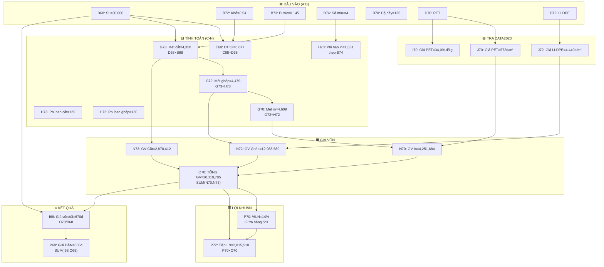

# 🔍 Phân Tích Vùng A66:Q74 — Sheet TRANG

## Tổng quan cấu trúc

Vùng `A66:Q74` là **bảng tính giá Sản phẩm 1**, được chia thành **3 khối** song song:

```
┌─────────────────┬──────────────────────────────────────────────────────┐
│   ĐẦU VÀO       │            BẢNG TỔNG HỢP GIÁ BÁN                   │
│   (A66:B74)      │            (C66:Q68)                                │
│                  ├──────────────────────────────────────────────────────┤
│   Thông số       │            CHI PHÍ SẢN XUẤT CHI TIẾT                │
│   sản phẩm       │            (C69:Q73)                                │
│                  ├──────────────────────────────────────────────────────┤
│                  │  Ô quyết định: B74 (số màu), P74 (cột LN)          │
└─────────────────┴──────────────────────────────────────────────────────┘
```

---

## 📋 Khối 1: ĐẦU VÀO — Thông số sản phẩm (A66:B74)

Đây là cột **nhập liệu** — người dùng nhập thông tin sản phẩm vào đây:

| Ô | Nhãn | Giá trị | Ghi chú |
|---|------|---------|---------|
| **A66** | Khách hàng | — | |
| **A67** | Tên hàng | — | |
| **A68** / **B68** | Số lượng TP | **30,000** | 🔑 Đầu vào chính |
| **A69** / **B69** | Cấu trúc | **PET12//PE120** | Mô tả cấu trúc màng |
| **A70** / **B70** | Độ dầy (mic) | **135** | Tổng độ dầy túi |
| **A71** / **B71** | Quai (0gr-7.2gr) | **0** | 0 = không có quai |
| **A72** / **B72** | Khổ trãi (m) | **0.54** | 🔑 Đầu vào chính |
| **A73** / **B73** | Bước cắt (m) | **0.145** | 🔑 Đầu vào chính |
| **A74** / **B74** | Số màu in | **4** | 🔑 Đầu vào chính |

---

## 📋 Khối 2: BẢNG TỔNG HỢP GIÁ BÁN (C66:Q68)

### Row 66: Header

| C66 | D66 | E66 | F66 | G66 | H66 | I66 | J66 | K66 | L66 | M66 | N66 | O66 | P66 | Q66 |
|-----|-----|-----|-----|-----|-----|-----|-----|-----|-----|-----|-----|-----|-----|-----|
| Khổ trãi | Bước cắt | DT 1 túi m² | Tổng DT ĐH | Khổ màng in TP | Dài màng TP | Giá vốn | Trục in | Zipper | Thùng giấy | Vận chuyển | Lãi vay | Hoa hồng | Giá cuối | Giá bán chốt |

### Row 67: Đơn vị + Tham chiếu

| Ô | ĐVT | Giá trị | Công thức |
|---|-----|---------|-----------|
| C67 | m | — | |
| D67 | m | — | |
| E67 | m² | — | |
| F67 | m² | — | |
| G67 | m | — | |
| H67 | m | — | |
| I67 | túi | — | |
| **J67** | — | **2,222,850** | `=G76` (giá trục in) |
| **K67** | — | **0** | `=(G73+H73)*B7` (chi phí zipper liên quan) |
| **N67** | — | **0.0082** | `=G79` (tỉ lệ lãi vay) |
| **O67** | — | **0** | `=E80` (hoa hồng/cái) |
| **P67** | — | Chưa VAT | |
| **Q67** | — | — | `=P64` |

### Row 68: 🔥 DÒNG TÍNH GIÁ CHÍNH

| Ô | Nội dung | Giá trị | Công thức | Ý nghĩa |
|---|----------|---------|-----------|----------|
| **C68** | Khổ trãi | 0.53 | — | = B72 (nhập tay) |
| **D68** | Bước cắt | 0.145 | `=B73` | Lấy từ đầu vào |
| **E68** | DT 1 túi | 0.07685 m² | `=C68*D68` | Khổ × Bước cắt |
| **F68** | Tổng DT | 2,305.5 m² | `=B68*E68` | SL × DT 1 túi |
| **G68** | Khổ màng in | 0.53 | `=IF(C68>0.4, C68, C68*2)` | Nếu khổ <0.4m → in đôi |
| **H68** | Dài màng | 4,350 m | `=D68*B68` | Bước cắt × SL |
| **I68** | **Giá vốn/túi** | **670.36** | `=O70/B68` | ← Tổng giá vốn / SL |
| **J68** | Trục in | — | — | (nhập hoặc 0) |
| **K68** | Zipper | 52.20 | `=D68*360` | Bước cắt × 360đ/m |
| **L68** | Thùng giấy | 10.00 | `=20000/2000` | Giá thùng / số túi |
| **M68** | Vận chuyển | 20.00 | `=30*20000/B68` | |
| **N68** | Lãi vay | 5.51 | `=G79*I68` | Tỉ lệ lãi × Giá vốn |
| **O68** | Hoa hồng | 50 | — | Nhập tay |
| **P68** | **Giá cuối** | **808.07** | `=SUM(I68:O68)` | ⭐ GIÁ BÁN |
| **Q68** | Giá chốt | 820 | — | Giá làm tròn |

---

## 📋 Khối 3: CHI PHÍ SẢN XUẤT CHI TIẾT (C69:Q73)

### Row 69: Header chi tiết

| C69 | D69 | E69 | F69 | G69 | H69 | I69 | J69 | K69 | L69 | M69 | N69 | O69 | P69 | Q69 |
|-----|-----|-----|-----|-----|-----|-----|-----|-----|-----|-----|-----|-----|-----|-----|
| Hạn mục CPSX | Màng NL | Độ dầy | Khổ màng | Số mét bán TP | Phi hao | Giá màng VNĐ/kg | TT màng VNĐ/m² | CPSX | TT CPSX | Giá màng In+Ghép | Giá vốn | Tổng giá vốn | LN | Doanh Thu |

### Row 70: CPSX IN (lớp ngoài)

| Ô | Giá trị | Công thức | Ý nghĩa |
|---|---------|-----------|----------|
| C70 | CPSX IN | — | Tên hạng mục |
| **D70** | PET | — | 🔑 Loại màng lớp 1 |
| **E70** | 12 mic | `=VLOOKUP(D70, Data2023!$B$6:$F$23, 3, FALSE)` | Tra độ dầy từ Data2023 |
| **F70** | 0.55 | — | Khổ màng NL (rộng hơn khổ TP) |
| **G70** | 4,608.86 | `=G72+H72` | Tổng mét = mét ghép + phi hao ghép |
| **H70** | 1,030.73 | `=IF(B74=8,1800,...,400) + G70/6000*40 + IF(G70>50000,...)` | Phi hao in theo số màu + mét |
| **I70** | 34,091 | `=VLOOKUP(D70, Data2023!$B$6:$F$22, 4, 0)` | Tra giá VNĐ/kg từ Data2023 |
| **J70** | 572.73 | `=VLOOKUP(D70, Data2023!$B$6:$F$24, 5, 0)` | Tra giá VNĐ/m² từ Data2023 |
| **K70** | 798 | `=B74*IF(D70="PET 12",135,...,120)*B80+318+B75` | CPSX/m (theo số màu × hệ số) |
| **L70** | 2,475,214 | `=K70*(H70+G70)*F70` | Thành tiền CPSX |
| **M70** | 1,776,470 | `=J70*(G70+H70)*F70` | Thành tiền màng |
| **N70** | 4,251,684 | `=M70+L70` | **Giá vốn = Màng + CPSX** |
| **O70** | 20,110,785 | `=SUM(N70:N73)` | ⭐ **TỔNG GIÁ VỐN** (cộng 4 dòng) |
| **P70** | 14% | `=IF(P74=1, tra_cot_U, tra_cot_W)` | ⭐ Tỉ lệ LN (IF lồng nhiều cấp) |
| **Q70** | 22,926,295 | `=O70+P72` | Doanh thu = Giá vốn + LN |

### Row 71: GHÉP LẦN 1 (lớp giữa — nếu có)

| Ô | Giá trị | Công thức | Ý nghĩa |
|---|---------|-----------|----------|
| **D71** | 0 | — | = 0 → Không có lớp giữa |
| G71 | 0 | `=IF(D71=0, 0, G72+H72)` | Nếu D71=0 → bỏ qua |
| K71 | 0 | `=IF(D71=0, 0, 684)` | CPSX ghép = 0 |
| **N71** | 0 | `=M71+L71` | Giá vốn lớp giữa = 0 |

### Row 72: GHÉP LẦN 2 (lớp trong)

| Ô | Giá trị | Công thức | Ý nghĩa |
|---|---------|-----------|----------|
| **D72** | LLDPE | — | 🔑 Loại màng lớp trong |
| E72 | 120 mic | `=VLOOKUP(D72, Data2023!)` | Tra từ Data2023 |
| F72 | 0.55 | `=F70` | Cùng khổ |
| G72 | 4,479 | `=G73+H73` | Mét bán TP = mét cắt + phi hao cắt |
| H72 | 129.86 | `=G72/3000*20+100` | Phi hao ghép |
| **J72** | 4,440 | `=VLOOKUP(D72, Data2023!)` | Giá VNĐ/m² |
| K72 | 684 | `=IF(D72=0, 0, 684)` | CPSX ghép cố định |
| **N72** | 12,988,689 | `=M72+L72` | Giá vốn lớp trong |
| **P72** | 2,815,510 | `=P70*O70` | Số tiền LN = %LN × Tổng giá vốn |

### Row 73: CPSX CẮT

| Ô | Giá trị | Công thức | Ý nghĩa |
|---|---------|-----------|----------|
| E73 | 3 | `=IF(OR(D71=0,D72=0), 3, 6)` | % phi hao cắt (3% nếu 2 lớp, 6% nếu 3 lớp) |
| G73 | 4,350 | `=D68*B68` | = Bước cắt × SL |
| H73 | 129 | `=G73/3000*20+100` | Phi hao cắt |
| K73 | 1,165.2 | `=IF(E68<0.07, 971×1.4, IF(E68<0.2, 971×1.2, 971×0.8))` | CPSX cắt theo DT túi |
| **N73** | 2,870,412 | `=M73+L73` | Giá vốn cắt |

### Row 74: Điều khiển

| Ô | Giá trị | Ý nghĩa |
|---|---------|----------|
| **B74** | 4 | Số màu in → ảnh hưởng phi hao (H70) + CPSX in (K70) |
| **P74** | 2 | Cột LN: **1** = túi thường (tra cột U), **2** = túi zip/3lớp (tra cột W) |

---

## 🔄 Luồng dữ liệu tổng hợp



> [!IMPORTANT]
> **Tóm lại**: Vùng A66:Q74 là một **"form tính giá"** hoàn chỉnh. Người dùng nhập thông số ở cột A:B, hệ thống tự động tra giá nguyên liệu từ Data2023, tính chi phí SX qua 4 bước (In → Ghép L1 → Ghép L2 → Cắt), cộng tổng giá vốn, tra lợi nhuận, rồi xuất ra giá bán cuối cùng tại **P68**.
