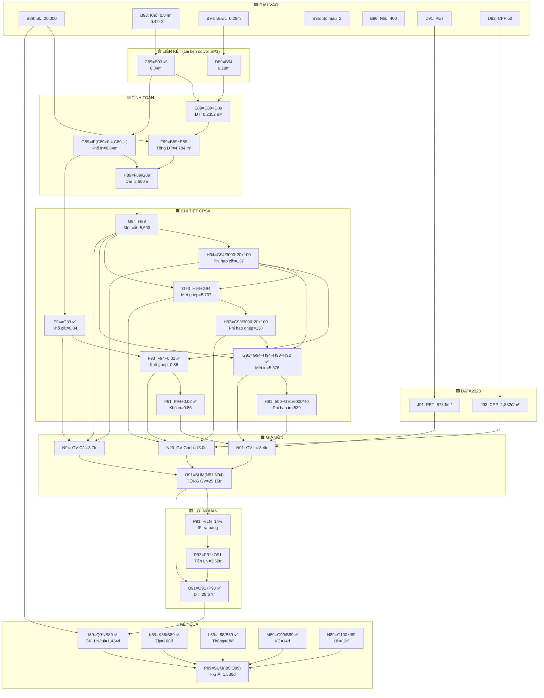

# 🔍 Phân Tích Vùng A87:Q95 — Sheet TRANG (Sản phẩm 2: BEYONO CAO CẤP)

## Tổng quan cấu trúc

Vùng `A87:Q95` là **bảng tính giá Sản phẩm 2**, cùng layout với SP1 nhưng **công thức liên kết tốt hơn**:

```
┌─────────────────┬──────────────────────────────────────────────────────┐
│   ĐẦU VÀO       │          BẢNG TỔNG HỢP GIÁ BÁN                     │
│   (A87:B95)      │        (C87:Q89)  ← Row 87-88: header/ref          │
│                  │                     Row 89: ⭐ dòng tính giá        │
│   Thông số       ├──────────────────────────────────────────────────────┤
│   sản phẩm       │          CHI PHÍ SẢN XUẤT CHI TIẾT                  │
│                  │        (C90:Q94)  ← Row 90: header                  │
│                  │                     Row 91: CPSX IN                  │
│                  │                     Row 92: GHÉP L1                  │
│                  │                     Row 93: GHÉP L2                  │
│                  │                     Row 94: CẮT                     │
│                  ├──────────────────────────────────────────────────────┤
│                  │  Row 95: B95 (số màu), P95 (cột LN)                 │
└─────────────────┴──────────────────────────────────────────────────────┘
```

---

## 📋 Khối 1: ĐẦU VÀO — Thông số sản phẩm (A87:B95)

| Ô | Nhãn | Giá trị | Ghi chú |
|---|------|---------|---------|
| A87 / B87 | Khách hàng | *(trống)* | |
| A88 / B88 | Tên hàng | **BEYONO CAO CAP** | |
| A89 / **B89** | Số lượng TP | **20,000** | 🔑 Đầu vào |
| A90 / B90 | Cấu trúc | **PET//CPP** | 2 lớp |
| A91 / **B91** | Độ dầy (mic) | **65** | PET 12 + CPP 50 = 62, + 3 phi hao |
| A92 / **B92** | Quai | **0** | Không có quai |
| A93 / **B93** | Khổ trãi (m) | **0.84** | `=0.42*2` → 2 con hình |
| A94 / **B94** | Bước cắt (m) | **0.28** | 🔑 Đầu vào |
| A95 / **B95** | Số màu in | **2** | 🔑 Đầu vào |

**Ô bổ sung (ngoài vùng nhưng liên quan):**

| Ô | Nhãn | Giá trị | Ghi chú |
|---|------|---------|---------|
| **B96** | Màu nhũ/mờ | **400** | Phụ phí in nhũ |
| **B97** | Zipper | **378** | Giá zipper/m (`=360*1.05`) |
| **P95** | Cột LN | **2** | LN túi zip/3 lớp |
| **B101** | Tỉ lệ phủ mực | **1** | 100% phủ |

---

## 📋 Khối 2: BẢNG TỔNG HỢP GIÁ BÁN (C87:Q89)

### Row 87: Header

| C87 | D87 | E87 | F87 | G87 | H87 | I87 | J87 | K87 | L87 | M87 | N87 | O87 | P87 | Q87 |
|-----|-----|-----|-----|-----|-----|-----|-----|-----|-----|-----|-----|-----|-----|-----|
| Khổ trãi | Bước cắt | DT 1 túi | Tổng DT ĐH | Khổ màng in TP | Dài màng TP | Giá vốn | Trục in | Zipper | Thùng giấy | Vận chuyển | Lãi vay | Hoa hồng | Giá cuối | Giá bán chốt |

### Row 88: Tham chiếu tổng

Tất cả các ô đều **liên kết tới phần chi tiết bên dưới** (Row 96-101):

| Ô | Giá trị | Công thức | Nguồn |
|---|---------|-----------|-------|
| **J88** | 3,842,720 | `=G97` | ← Tổng giá trục in |
| **K88** | 2,168,712 | `=(G94+H94)*B97` | ← (Mét cắt + phi hao) × 378đ/m |
| **L88** | 360,000 | `=G98` | ← Tổng thùng giấy |
| **M88** | 284,357 | `=G99` | ← Tổng vận chuyển |
| **N88** | 0.00822 | `=G100` | ← Tỉ lệ lãi vay/ngày × 30 ngày |
| **O88** | 0 | `=E101` | ← Tỉ lệ hoa hồng (0%) |
| **P88** | Chưa VAT | — | Label |
| **Q88** | 1,697.48 | `=P86` | ← Giá chốt (từ bảng giá KHĐ) |

### Row 89: 🔥 DÒNG TÍNH GIÁ CHÍNH

| Ô | Nội dung | Giá trị | Công thức | Ý nghĩa |
|---|----------|---------|-----------|----------|
| **C89** | Khổ trãi | 0.84 | ✅ `=B93` | Liên kết đầu vào |
| **D89** | Bước cắt | 0.28 | ✅ `=B94` | Liên kết đầu vào |
| **E89** | DT 1 túi | 0.2352 m² | `=C89*D89` | 0.84 × 0.28 |
| **F89** | Tổng DT | 4,704 m² | `=B89*E89` | 20,000 × 0.2352 |
| **G89** | Khổ màng in | 0.84 m | `=IF(C89>0.4, C89, C89*2)` | >0.4 → giữ nguyên |
| **H89** | Dài màng | 5,600 m | `=F89/G89` | 4,704 / 0.84 |
| **I89** | **Giá vốn+LN/túi** | **1,433.74** | ✅ `=Q91/B89` | Doanh thu SX ÷ SL |
| **J89** | Trục in | ❌ *trống* | — | Không tính vào giá |
| **K89** | Zipper | 108.44 | ✅ `=K88/B89` | Tổng zip ÷ SL |
| **L89** | Thùng giấy | 18.00 | ✅ `=L88/B89` | Tổng thùng ÷ SL |
| **M89** | Vận chuyển | 14.22 | ✅ `=G99/B89` | Tổng VC ÷ SL |
| **N89** | Lãi vay | 11.78 | `=G100*I89` | Tỉ lệ lãi × giá vốn |
| **O89** | Hoa hồng | 0 | ✅ `=O88*I89` | Tỉ lệ HH × giá vốn |
| **P89** | **Giá cuối** | **1,586.18** | `=SUM(I89:O89)` | ⭐ ĐÃ GỒM LN |
| **Q89** | Giá chốt | *(trống)* | `=B102` | B102 trống |

---

## 📋 Khối 3: CHI PHÍ SẢN XUẤT CHI TIẾT (C90:Q94)

### Row 90: Header chi tiết
*(Giống Row 69)*

### Row 91: CPSX IN — Lớp ngoài (PET 12mic)

| Ô | Giá trị | Công thức | Ý nghĩa |
|---|---------|-----------|----------|
| **D91** | PET | — | Loại màng lớp ngoài |
| **E91** | 12 mic | `=VLOOKUP(D91, Data2023!$B$6:$F$23, 3, FALSE)` | Tra độ dầy |
| **F91** | 0.86 m | ✅ `=IF(D91=0, 0, F94+0.02)` | Khổ TP + 2cm lề (tự động!) |
| **G91** | 5,875.58 m | ✅ `=IF(D91=0, 0, G94+H94+H93+H92)` | Mét cắt + TẤT CẢ phi hao |
| **H91** | 539.17 m | `=IF(B95=2,500,...) + G91/6000*40 + ...` | Setup 500 (2 màu) + phi hao mét |
| **I91** | 34,091 | `=VLOOKUP(D91, Data2023!, 4, 0)` | Giá PET VNĐ/kg |
| **J91** | 572.73 | `=VLOOKUP(D91, Data2023!, 5, 0)` | Giá PET VNĐ/m² |
| **K91** | ⚠️ 958 | `=B95*IF(D91="PET 12",135,...120)*B101+318+B96` | CPSX/m (dùng 120 thay vì 135) |
| **L91** | 5,284,987 | `=K91*(H91+G91)*F91` | Thành tiền CPSX |
| **M91** | 3,159,557 | `=J91*(G91+H91)*F91` | Thành tiền màng |
| **N91** | 8,444,544 | `=M91+L91` | **Giá vốn lớp IN** |
| **O91** | 25,153,304 | `=SUM(N91:N94)` | ⭐ **TỔNG GIÁ VỐN** |
| **P91** | 14% | `=IF(P95=1, tra_cot_U, tra_cot_W)` | Tra bảng LN |
| **Q91** | 28,674,766 | `=O91+P93` | ⭐ **DOANH THU = GV + LN** |

> [!NOTE]
> **K91 chi tiết**: `= 2 × 120 × 1 + 318 + 400 = 958`
> - B95=2 (số màu), hệ số 120 (vì D91="PET" ≠ "PET 12"), B101=1 (phủ mực), +318 (cố định), B96=400 (nhũ)
> - ⚠️ Nếu sửa IF thành kiểm tra "PET": `2 × 135 × 1 + 318 + 400 = 988` (chênh 30đ/m)

### Row 92: GHÉP LẦN 1 — Lớp giữa (không dùng)

| Ô | Giá trị | Công thức | Ý nghĩa |
|---|---------|-----------|----------|
| **D92** | 0 | — | Không có lớp giữa |
| F92 | 0 | `=IF(D92=0, 0, F94+0.02)` | ✅ Có điều kiện |
| G92 | 0 | `=IF(D92=0, 0, G93+H93)` | ✅ Có điều kiện |
| K92 | 0 | `=IF(D92=0, 0, 684)` | ✅ Có điều kiện |
| **N92** | 0 | `=M92+L92` | Giá vốn = 0 |

### Row 93: GHÉP LẦN 2 — Lớp trong (CPP 50mic)

| Ô | Giá trị | Công thức | Ý nghĩa |
|---|---------|-----------|----------|
| **D93** | CPP 50 | — | Loại màng lớp trong |
| **E93** | 50 mic | `=VLOOKUP(D93, Data2023!, 3, FALSE)` | Tra độ dầy |
| **F93** | 0.86 m | ✅ `=IF(D93=0, 0, F94+0.02)` | Khổ TP + 2cm lề |
| **G93** | 5,737.33 m | `=IF(F93=0, 0, H94+G94)` | Mét cắt + phi hao cắt |
| **H93** | 138.25 m | `=IF(G93=0, 0, G93/3000*20+100)` | Phi hao ghép |
| **I93** | 40,909 | `=VLOOKUP(D93, Data2023!, 4, 0)` | Giá CPP VNĐ/kg |
| **J93** | 1,881.82 | `=VLOOKUP(D93, Data2023!, 5, 0)` | Giá CPP VNĐ/m² |
| **K93** | 684 | `=IF(D93=0, 0, 684)` | CPSX ghép cố định |
| **L93** | 3,456,252 | `=K93*(H93+G93)*F93` | Thành tiền CPSX ghép |
| **M93** | 9,508,829 | `=J93*(G93+H93)*F93` | Thành tiền màng CPP |
| **N93** | 12,965,081 | `=M93+L93` | **Giá vốn lớp GHÉP** |
| **P93** | 3,521,463 | `=P91*O91` | Số tiền LN = 14% × 25.15tr |

### Row 94: CPSX CẮT

| Ô | Giá trị | Công thức | Ý nghĩa |
|---|---------|-----------|----------|
| **E94** | 3% | `=IF(OR(D92=0,D93=0), 3, 6)` | Phi hao cắt (2 lớp → 3%) |
| **F94** | 0.84 m | ✅ `=G89` | Khổ cắt = Khổ màng in TP |
| **G94** | 5,600 m | `=H89` | Mét cắt = Dài màng TP |
| **H94** | 137.33 m | `=G94/3000*20+100` | Phi hao cắt |
| **J94** | 0 | `=VLOOKUP(D94,...)` | D94 trống → 0 |
| **K94** | 776.8 | `=IF(E89<0.07, 971×1.4, IF(E89<0.2, 971×1.2, 971×0.8))` | E89=0.2352 → 971×0.8 |
| **L94** | 3,743,679 | `=K94*(H94+G94)*F94` | Thành tiền CPSX cắt |
| **M94** | 0 | `=(I100+J100)*D103` | I100,J100 trống |
| **N94** | 3,743,679 | `=M94+L94` | **Giá vốn CẮT** |

### Row 95: Điều khiển

| Ô | Giá trị | Ý nghĩa |
|---|---------|----------|
| **B95** | 2 | Số màu → ảnh hưởng phi hao H91 (500m) + CPSX K91 |
| **P95** | 2 | Cột LN: **2** = túi zip/3lớp → tra cột W (tỉ lệ cao hơn) |

---

## 🔄 Luồng dữ liệu SP2



---

## 📌 Tóm tắt các công thức quan trọng

### Công thức nổi bật (cải tiến so với SP1)

```
C89 = B93                              ← Liên kết khổ trãi ✅
F91 = IF(D91=0, 0, F94+0.02)           ← Khổ NL tự động = khổ TP + 2cm ✅
G91 = G94+H94+H93+H92                  ← Mét in = cắt + tất cả phi hao ✅
F94 = G89                              ← Khổ cắt = khổ in TP ✅
I89 = Q91/B89                          ← Giá vốn ĐÃ GỒM LN ✅
K89 = K88/B89 = (G94+H94)*B97/B89      ← Zipper liên kết qua K88 ✅
L89 = L88/B89 = G98/B89                ← Thùng liên kết qua L88 ✅
M89 = G99/B89                          ← VC liên kết chi tiết ✅
O89 = O88*I89                          ← HH dùng tỉ lệ × giá vốn ✅
```

### Bảng kết quả giá bán

| Hạng mục | VNĐ/túi | % trong giá | Công thức |
|----------|---------|-------------|-----------|
| Giá vốn + LN | 1,433.74 | 90.4% | `=Q91/B89` |
| Zipper | 108.44 | 6.8% | `=K88/B89` |
| Thùng giấy | 18.00 | 1.1% | `=L88/B89` |
| Vận chuyển | 14.22 | 0.9% | `=G99/B89` |
| Lãi vay | 11.78 | 0.7% | `=G100*I89` |
| Hoa hồng | 0 | 0% | `=O88*I89` |
| **Giá cuối** | **1,586.18** | **100%** | `=SUM(I89:O89)` |

> [!NOTE]
> **Ngoài vùng A87:Q95**, giá cuối cùng đi qua thêm 2 bước:
> - **P84** = `SUM(I89:N89) × 1.05` = 1,665đ *(giá không hóa đơn, +5%)*
> - **P86** = `P84 + 32` = **1,697đ** *(giá chốt, +32đ làm tròn)*
> - **Q88** = `P86` = **1,697đ** *(hiển thị lại ở header)*

---

## ⚠️ 3 lỗi còn tồn tại

### Lỗi 1: ❌ K91 — Điều kiện IF sai tên màng

```
K91 = B95 * IF(D91="PET 12", 135, IF(D91="PA 15", 135, 120)) * B101 + 318 + B96
```

- D91 = `"PET"` nhưng kiểm tra `"PET 12"` → **không khớp** → dùng **120**
- Kết quả hiện tại: `2 × 120 × 1 + 318 + 400 = 958`
- Nếu đúng: `2 × 135 × 1 + 318 + 400 = 988` → **chênh 30đ/m**
- Tác động: L91 thay đổi → N91 → O91 → Q91 → I89 → P89

### Lỗi 2: ❌ J89 trống — Trục in không tính vào giá

- J88 = 3,842,720đ (`=G97`), nhưng J89 = **trống**
- Nếu tính: J89 = 3,842,720/20,000 = **192đ/túi** bị bỏ sót
- P89 sẽ là 1,586 + 192 = **1,778đ/túi**

### Lỗi 3: ⚠️ Thiếu ô kiểm tra (validation)

- SP1 có B82 = `IF(SUM(E70:E73)=B70, "OK", "SAI")` kiểm tra tổng độ dầy
- SP2 **không có ô tương đương**
